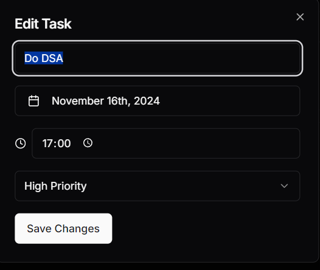

# Task Manager

A modern, feature-rich task management application built using **Next.js** and **shadcn/ui** components, designed to streamline task organization and improve productivity.

---

## **Features**

### **Task Management**

- **Add Tasks**: Create tasks with a title, priority levels (Low, Medium, High), due date, and time.
- **Edit Tasks**: Modify task details anytime.
- **Delete Tasks**: Remove unwanted tasks from the list.
- **Mark Completion**: Mark tasks as complete or incomplete with a single click.
- **Task History**: View completed tasks in a dedicated sidebar and restore them if needed.

### **Organization**

- **Sorting by Priority**: Sort tasks based on their priority (High, Medium, Low).
- **Search Bar**: Quickly locate tasks using the intuitive search functionality.
- **Task Separation**: Clear distinction between active and completed tasks.
- **Date & Time Tracking**: Each task is timestamped for better tracking.

### **User Experience**

- **Dark/Light Mode**: Switch between dark and light themes for a comfortable viewing experience.
- **Toast Notifications**: Instant feedback for task actions like adding, deleting, or completing.
- **Smooth Animations**: Enhanced interactions using Framer Motion.
- **Responsive Design**: Seamlessly adapts to all screen sizes.
- **Intuitive Calendar Picker**: Select dates with ease for scheduling tasks.
- **Real-Time Updates**: Task list dynamically updates as actions are performed.

---

## **Setup and Launch**

Follow these steps to set up and run the application locally:

1. **Clone the Repository**:
    
    ```bash

    git clone [repository-url]
    
    ```
    
2. **Install Dependencies**:
    
    ```bash

    npm install --legacy-peer-deps
    
    ```
    
    *or*
    
    ```bash

    yarn install
    
    ```
    
3. **Start the Development Server**:
    
    ```bash

    npm run dev
    
    ```
    
    *or*
    
    ```bash

    yarn dev
    
    ```
    
4. **Access the Application**:
Open your browser and navigate to [http://localhost:3000](http://localhost:3000/).

---

## **Development Assumptions**

- **Authentication**: Currently, user authentication is not implemented.
- **Modern Browsers**: Optimized for modern browsers with ES6+ support.
- **Local Storage**: Task data is stored locally on the user's browser.
- **Single-User Environment**: Designed for personal task management.
- **Desktop-First Design**: Prioritizes desktop usability while maintaining responsive layouts.
- **Language**: Interface is available in English.

---

## **Screenshots**

Here are some screenshots to showcase the application features:

- **Home Page**


- **Home Page (Light Mode)**


- **Task List**


- **Search Bar**


- **Sidebar with Completed Tasks**


- **Edit Task Dialog**



- **Task Toaster Notification**


---

## **Tech Stack**

The Task Manager leverages a modern tech stack to deliver a robust and visually appealing user experience:

- **Framework**: Next.js 14
- **Frontend**: React 19
- **Language**: TypeScript
- **UI Library**: shadcn/ui components
- **Styling**: Tailwind CSS
- **Animations**: Framer Motion
- **Date Handling**: date-fns
- **Icons**: Lucide Icons

---

Feel free to contribute or raise issues to improve the application further. Happy task managing! 🚀
